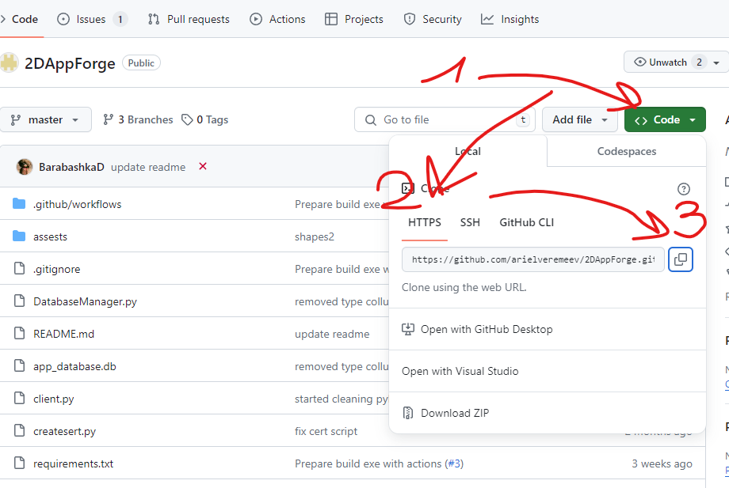

# install python
## on linux with internal venv
sudo apt update
sudo apt install python3
sudo apt install pip3
sudo apt install python3.10-venv

### other options
TBD conda
TBD virtualenv

# create virtual enviroment 
python3 -m venv .test1
## on linux 
source ./tet1/bin/activate

# required external python libraries:
bcrypt
pyopenssl
pyinstaller

pip3 install -r requirements.txt

# required internal python libraries:
socket
sqlite3

# install steps:
* creating certificate for server side
    python createsert.py

# Apps
    server.py - console server
    client.py - console client
    uiclient.py - tkinter based GUI client

# How to clone

